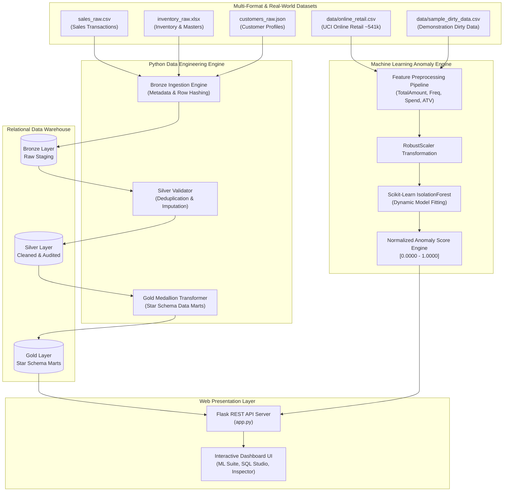

# Smart Retail Data Lake & ML Anomaly Detection Platform 🚀

[](https://www.python.org/)
[](https://scikit-learn.org/)
[](https://flask.palletsprojects.com/)
[](https://www.postgresql.org/)
[](https://powerbi.microsoft.com/)
[](#medallion-architecture)

An end-to-end data platform combining a **Bronze–Silver–Gold Medallion Data Lake ETL Architecture** with an **unsupervised Machine Learning Anomaly Detection System** trained on the real-world **UCI Machine Learning Repository "Online Retail" dataset**.

The platform ingests multi-format retail data (CSV, Excel, JSON), executes automated data validation and star-schema transformations, trains a scikit-learn **`IsolationForest`** model dynamically on derived transaction features, and serves a modern glassmorphism dark-mode web application featuring real-time hyperparameter tuning, interactive ML visual diagnostics, a SQL Studio workbench, and schema explorer.

---

## 🏗️ System Architecture



---

## 🤖 Machine Learning Anomaly Detection System

The ML subsystem uses scikit-learn's **`IsolationForest`** model to detect suspicious retail transactions dynamically.

### 1. Primary Datasets
* **`data/online_retail.csv`**: Authentic UCI Machine Learning Repository Online Retail dataset (~541,909 transactions across 373 days). Standard schema: `InvoiceNo`, `StockCode`, `Description`, `Quantity`, `InvoiceDate`, `UnitPrice`, `CustomerID`, `Country`.
* **`data/sample_dirty_data.csv`**: Demonstration sample with realistic intentional data-quality bugs (missing Customer IDs, duplicate rows, negative quantities, extreme unit prices, invalid dates, inconsistent country casing).

### 2. Feature Engineering & Preprocessing Pipeline (`etl/ml_preprocessing.py`)
Converts raw transactions into 7 numerical indicators before model training:
- **`TotalAmount`**: Transaction size ($\text{Quantity} \times \text{UnitPrice}$).
- **`Quantity`**: Item volume count.
- **`UnitPrice`**: Individual unit price.
- **`CustomerPurchaseFrequency`**: Total count of orders per customer.
- **`CustomerTotalSpend`**: Lifetime monetary spend per customer.
- **`AverageTransactionValue`**: Mean spend per order per customer.
- **`CountryTransactionCount`**: Transaction volume density per country.
- **`RobustScaler`**: Scaling technique robust to extreme financial outliers.

### 3. Crucial Architecture: Data Quality Bug vs ML Anomaly Separation
The system strictly separates **Rule-Based Data Quality Validation** from **ML Anomaly Detection**:

| Category | Detection Engine | Examples / Triggers | UI Display |
| :--- | :--- | :--- | :--- |
| **⚠️ DATA QUALITY ISSUE** | Rule-Based Logic | Missing CustomerID, duplicate rows, negative quantity on normal sales, invalid timestamps, unit price $\le \$0$ or $> \$50,000$. | Amber Badge (`DQ ISSUE`) |
| **🧠 ML-DETECTED ANOMALY** | `IsolationForest` Model | Extreme total monetary amount (e.g. $\$95,000$ purchase), abnormal unit price relative to volume, outlier customer spend density. | Pink Badge (`ML ANOMALY`) |
| **✅ NORMAL** | Baseline Engine | Standard clean retail transaction. | Green Badge (`NORMAL`) |

### 4. Interactive Hyperparameter Controls
Through the web dashboard, users can tune model parameters live and fit a fresh forest on demand:
* **Contamination Rate**: Expected outlier proportion (range `0.01` to `0.20`, default `0.05`).
* **Number of Estimators**: Forest tree count (range `10` to `300`, default `100`).
* **Random State Seed**: Random seed for reproducible fits (default `42`).

---

## 🏅 Medallion Data Lake Architecture

### 1. 🟤 Bronze Layer (Raw Staging) — `etl/ingestion.py`
* Supports `.csv`, `.xlsx` (multi-sheet), and `.json` formats.
* Injects audit lineage metadata: `ingested_at`, `source_file`, `batch_id`, `row_hash`.

### 2. ⚪ Silver Layer (Cleansing & Auditing) — `etl/validation.py`
* Schema validation, type normalization, deduplication, and missing value imputation.
* Records all validation errors into the `silver_validation_log` database audit trail.

### 3. 🟡 Gold Layer (Star Schema Data Mart) — `etl/transformations.py`
* **Fact Tables**: `fact_sales` (revenue, cost, profit, margin %), `fact_inventory_snapshot` (stock valuation, reorder alerts).
* **Dimension Tables**: `dim_customers` (enrolled with **RFM Segmentation**), `dim_products`, `dim_stores`.

---

## 💻 Tech Stack

- **Core & Data Engineering**: Python 3.10+, Pandas, NumPy, OpenPyXL
- **Machine Learning**: scikit-learn (`IsolationForest`, `RobustScaler`, `StandardScaler`)
- **Database & ORM**: PostgreSQL, SQLite, SQLAlchemy 2.0
- **Backend Web Server**: Flask 3.0, Flask-CORS
- **Frontend UI & Visuals**: HTML5, Vanilla CSS3 (Glassmorphism), JavaScript (ES6+), Chart.js, FontAwesome 6
- **Testing**: pytest

---

## 🔌 REST API Endpoints Reference

| Endpoint | Method | Description |
| :--- | :--- | :--- |
| `/api/ml/anomaly-detect` | `POST` | Triggers dynamic Isolation Forest model training & returns full evaluation report, KPIs, score distribution histogram, country breakdown, and top suspicious transactions. |
| `/api/ml/datasets` | `GET` | Returns available datasets (`online_retail.csv`, `sample_dirty_data.csv`) with record counts and file sizes. |
| `/api/pipeline/run` | `POST` | Triggers end-to-end Bronze-Silver-Gold Medallion ETL pipeline run. |
| `/api/kpis` | `GET` | Returns consolidated executive KPIs, financial stats, RFM customer segments, and monthly trends. |
| `/api/sql/execute` | `POST` | Safely executes custom SQL queries in SQL Studio. |
| `/api/table/<table_name>`| `GET` | Sample data inspector for data lake tables. |

---

## 🚀 Quickstart & Execution Guide

### 1. Installation
```bash
git clone https://github.com/kiranjoshi02003-cmyk/Smart-Retail-Data-Lake-ETL-Platform.git
cd Smart-Retail-Data-Lake-ETL-Platform

# Create virtual environment
python -m venv venv
# Windows:
venv\Scripts\activate
# Linux/macOS:
source venv/bin/activate

# Install dependencies
pip install -r requirements.txt
```

### 2. Generate Datasets & Run Datake Pipeline
```bash
# Generate UCI Online Retail dataset & demonstration dirty sample
python -m etl.generate_retail_dataset

# Generate Bronze-Silver-Gold multi-format ETL data
python etl/generate_data.py
python etl/pipeline.py
```

### 3. Run Automated Tests
```bash
python -m pytest tests/
```

### 4. Launch Flask Web Application
```bash
python app.py
```
Navigate to **`http://127.0.0.1:5000`** in your web browser.

---

## 📁 Directory Structure

```
smart-retail-etl-platform/
├── app.py                          # Flask Web server & REST API routes
├── requirements.txt                # Python dependencies
├── README.md                       # Documentation
│
├── data/                           # Data Lake & ML Dataset Storage
│   ├── online_retail.csv           # UCI Machine Learning Repository Online Retail dataset
│   ├── sample_dirty_data.csv       # Demonstration dataset with intentional DQ bugs
│   ├── smart_retail_datalake.db    # Local SQLite relational data lake database
│   ├── raw/                        # Bronze staging raw files (CSV, Excel, JSON)
│   ├── silver/                     # Cleaned intermediate data
│   └── gold/                       # Analytical star schema data marts
│
├── etl/                            # Data Engineering & ML Engine Modules
│   ├── config.py                   # Configuration, file paths & ML defaults
│   ├── db.py                       # Database connection manager
│   ├── generate_data.py            # Multi-format raw data generator
│   ├── generate_retail_dataset.py  # UCI Online Retail & dirty dataset generator
│   ├── ingestion.py                # Bronze layer ingestion engine
│   ├── validation.py               # Silver layer data quality validator
│   ├── transformations.py          # Gold layer star schema & RFM segmentation
│   ├── pipeline.py                 # End-to-end Medallion pipeline orchestrator
│   ├── ml_preprocessing.py         # Derived feature engineering & Robust scaling
│   └── ml_anomaly.py               # Isolation Forest engine & DQ vs ML classifier
│
├── web/                            # Single-Page Web Dashboard
│   ├── templates/
│   │   └── index.html              # Modern dark UI layout & workspace views
│   └── static/
│       ├── css/styles.css          # Glassmorphism dark styling & status badges
│       └── js/
│           ├── app.js              # Tab controller & ML anomaly API client
│           ├── charts.js           # Chart.js histogram & country chart engines
│           └── sql_workbench.js    # Interactive SQL Studio query execution handler
│
├── sql/                            # Production SQL DDLs & Analytical Queries
│   ├── 01_bronze_ddl.sql
│   ├── 02_silver_ddl.sql
│   ├── 03_gold_ddl.sql
│   └── 04_business_kpis.sql
│
├── powerbi/                        # Power BI Documentation & DAX Measures
│   ├── dax_measures.dax
│   └── dashboard_spec.md
│
└── tests/                          # Automated Pytest Suite
    ├── test_etl_pipeline.py        # Medallion pipeline unit tests
    └── test_ml_anomaly.py          # ML Isolation Forest & API contract unit tests
```
