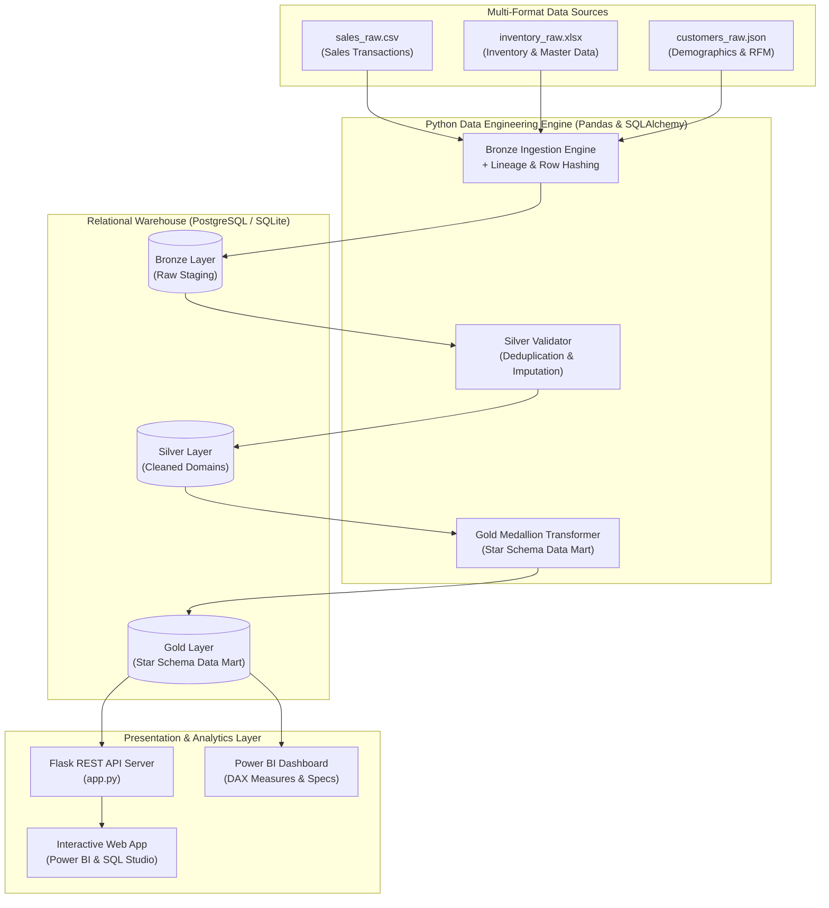

# Smart Retail Data Lake & ETL Platform 🚀

[](https://www.python.org/)
[](https://flask.palletsprojects.com/)
[](https://www.postgresql.org/)
[](https://powerbi.microsoft.com/)
[](#medallion-architecture)

An end-to-end data engineering platform that ingests multi-format retail data (**CSV sales, Excel inventory, and JSON customer profiles**), executes automated data cleaning, validation, and transformations through a **Bronze–Silver–Gold Medallion Architecture**, loads analytics-ready data into **PostgreSQL / SQLite**, serves a **Flask REST API**, and features an interactive **Power BI-style executive dashboard**, **SQL query studio**, and **lineage inspector**.

---

## 🏗️ System Architecture



---

## 🏅 Medallion Data Lake Architecture

### 1. 🟤 Bronze Layer (Raw Staging)
- **Ingestion Handlers**: Native support for `.csv`, `.xlsx` (multi-sheet), and `.json`.
- **Lineage Metadata**: Automatically injects audit columns into every staging table:
  - `ingested_at`: UTC timestamp of ingestion execution.
  - `source_file`: Absolute source file path and sheet moniker.
  - `batch_id`: Unique batch identifier (`BATCH-YYYYMMDDHHMMSS`).
  - `row_hash`: SHA-256 row signature for change data capture and deduplication.

### 2. ⚪ Silver Layer (Cleansing & Normalization)
- **Schema Validation & Type Casting**: Standardizes datetimes, currencies, and numeric bounds.
- **Automated Deduplication**: Removes duplicate transactions while logging anomalies.
- **Null Imputation**: Generates fallback records for missing fields (e.g., missing emails, payment methods).
- **Data Quality Audit Trail**: Every quality check issue is recorded in `silver_validation_log`.

### 3. 🟡 Gold Layer (Analytics-Ready Star Schema Data Mart)
- **Fact Tables**:
  - `fact_sales`: Granular transaction details with unit cost, gross revenue, COGS, net profit, and profit margin %.
  - `fact_inventory_snapshot`: Daily inventory valuation, reorder point alerts, and safety stock flags.
- **Dimension Tables**:
  - `dim_customers`: Customer profiles with automated **RFM (Recency, Frequency, Monetary)** segmentation tiers (`Champions`, `Loyal Customers`, `Potential Loyalists`, `At Risk`).
  - `dim_products`: Catalog items with unit margins and supplier details.
  - `dim_stores`: Physical store locations and regional hierarchy.
- **Aggregated Data Marts**:
  - `gold_daily_sales_summary`: Pre-calculated daily revenue, profit, order count, and AOV.
  - `gold_category_performance`: Category profit margins and unit volumes.

---

## 💻 Tech Stack

- **Core & ETL Pipeline**: Python 3.10+, Pandas, NumPy, OpenPyXL
- **Database & ORM**: PostgreSQL, SQLite, SQLAlchemy 2.0
- **Backend Web Server**: Flask 3.0, Flask-CORS
- **Frontend & Visuals**: HTML5, Vanilla CSS3 (Glassmorphism), JavaScript (ES6+), Chart.js, FontAwesome
- **Analytics & BI**: SQL, Power BI DAX Measures

---

## 🚀 Quickstart & Execution Guide

### 1. Installation & Environment Setup
Clone the repository and install the dependencies:
```bash
git clone https://github.com/your-username/smart-retail-etl-platform.git
cd smart-retail-etl-platform

# Create virtual environment
python -m venv venv
# On Windows:
venv\Scripts\activate
# On Linux/macOS:
source venv/bin/activate

# Install required packages
pip install -r requirements.txt
```

### 2. Run Data Generator & ETL Pipeline (Command Line)
Generate sample datasets and run the full Bronze-Silver-Gold pipeline:
```bash
# Generate sample raw files (CSV, Excel, JSON)
python etl/generate_data.py

# Execute Medallion Pipeline
python etl/pipeline.py
```

### 3. Launch Flask Backend & Interactive Web App
```bash
python app.py
```
Open your browser and navigate to: **`http://127.0.0.1:5000`**

### 4. Run Automated Test Suite
```bash
pytest tests/test_etl_pipeline.py -v
```

---

## 📊 Business SQL Analytics Queries

The project includes pre-built production SQL queries in `sql/04_business_kpis.sql`:
1. **Monthly Revenue & Net Profit Growth (MoM)**
2. **Customer RFM Segmentation Matrix**
3. **Inventory Reorder Alert & Deficit Warning**
4. **Top 10 High Margin Products**
5. **Store & Regional Profitability Matrix**

---

## 📈 Power BI Integration

- **DAX Measures**: Find pre-written, copy-pasteable formulas in [`powerbi/dax_measures.dax`](powerbi/dax_measures.dax) for YTD Sales, Stock Turnover, and RFM Customer Segment counts.
- **Report Specification**: Detailed visual layout instructions and filter setup available in [`powerbi/dashboard_spec.md`](powerbi/dashboard_spec.md).

---

## 📁 Directory Structure

```
smart-retail-etl-platform/
├── data/                      # Data Lake storage directory
│   ├── raw/                   # Raw CSV, XLSX, and JSON files
│   └── smart_retail_datalake.db # Default local SQLite database
├── etl/                       # Python Data Engineering Modules
│   ├── config.py              # Configuration & settings
│   ├── db.py                  # Database connection manager
│   ├── generate_data.py       # Multi-format raw data generator
│   ├── ingestion.py           # Bronze ingestion engine
│   ├── validation.py          # Silver data quality validator
│   ├── transformations.py     # Silver cleansing & Gold star schema builder
│   └── pipeline.py            # End-to-end pipeline orchestrator
├── app.py                     # Flask Web Server & API Controllers
├── sql/                       # Production SQL DDLs & Analytical Queries
│   ├── 01_bronze_ddl.sql
│   ├── 02_silver_ddl.sql
│   ├── 03_gold_ddl.sql
│   └── 04_business_kpis.sql
├── powerbi/                   # Power BI Documentation & DAX
│   ├── dax_measures.dax
│   └── dashboard_spec.md
├── web/                       # Frontend Single Page Web App
│   ├── templates/
│   │   └── index.html
│   └── static/
│       ├── css/styles.css
│       └── js/
│           ├── app.js
│           ├── charts.js
│           └── sql_workbench.js
├── tests/                     # Pytest Unit Test Suite
│   └── test_etl_pipeline.py
├── requirements.txt           # Project Dependencies
└── README.md                  # Project Documentation
```
